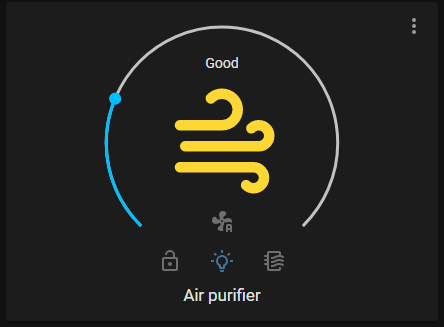

# Air purifier Card

A Home Assistant Lovelace custom card for Air purifier IKEA Starkvind.

## Features

|                                       | Function                                    |
|:------------------------------------: | :------------------------------------------ |
|         | Toggle power on/off                         |
| Slider                                | Set fan speed                               |
|              | Set to 'Auto mode'                          |
|     | Toggle child lock                           |
|  | Toggle led on/off                           |
|            | Indicate to check filter                    |
| Air quality                           | Show PM2.5 value or text (Change in config) |

## Install

### HACS (comming...)

### Manual install

1. Download and copy `air-purifier-card.js` from the [latest release](https://github.com/hakaneriksson/air-purifier-card/releases/latest) into your `config/www` directory.

### Add resource reference

1. Navigate to Configuration -> Lovelace Dashboards -> Resources Tab. Press (+) Add Resource button
2. Enter URL `/local/air-purifier-card.js` and select type "JavaScript Module".

## Requirement
- zigbee2mqtt 1.22.1 or later
